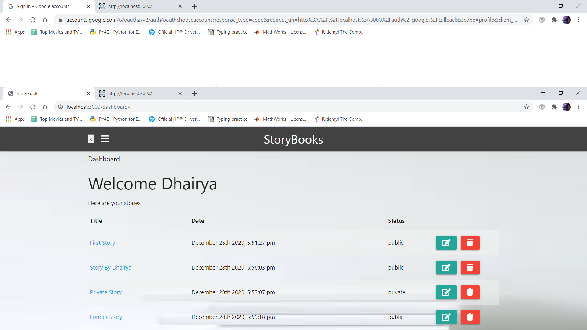
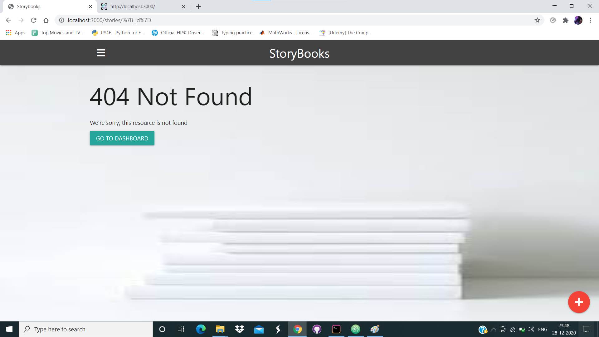

# StoryBooks

> Create public and private stories from your life

This app uses Node.js/Express/MongoDB with Google OAuth for authentication

## Images
  
   
    

## Features
- Place to store all your private and public stories from your life.
- View stories created by users from anywhere.
- Secure login using Google.
- Easy to add and edit stories.
- Easy logout
- Read more about the whole story
- Responsive, mobile-friendly design

## Usage
Add your mongoDB URI and Google OAuth credentials to the config.env file

```
# Install dependencies
npm install

# Run in development
npm run dev

# Run in production
npm start
```
